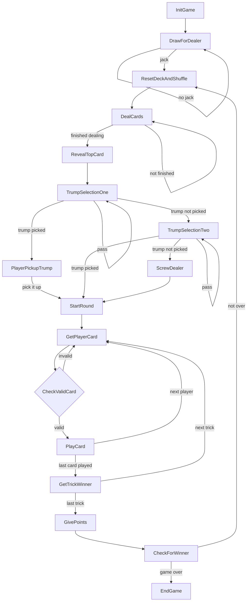

```mermaid
flowchart TB
    0[InitGame]
    1[DrawForDealer] 
    2[ResetDeckAndShuffle]
    3[DealCards]
    4[RevealTopCard]
    5[TrumpSelectionOne]
    6[PlayerPickupTrump]
    8[TrumpSelectionTwo]
    9[ScrewDealer]
    10[StartRound]
    11[GetPlayerCard]
    12{CheckValidCard}
    13[PlayCard]
    14[GetTrickWinner]
    15[GivePoints]
    16[CheckForWinner]
    17[EndGame]
    0 --> 1
    1 --> |no jack|1
    1 --> |jack| 2
    2 --> 3
    3 -- finished dealing --> 4
    3 -- not finished --> 3
    4 --> 5
    5 --> |pass| 5
    5 --> |trump picked| 6
    5 --> |trump not picked| 8
    6 --> |pick it up| 10
    8 --> |pass| 8
    8 --> |trump picked| 10
    8 --> |trump not picked| 9
    9 --> 10
    10 --> 11
    11 --> 12
    12 --> |valid| 13
    12 --> |invalid| 11
    13 --> |next player| 11
    13 --> |last card played| 14
    14 -- next trick --> 11
    14 -- last trick --> 15
    15 --> 16
    16 --> |game over| 17
    16 --> |not over| 2
```